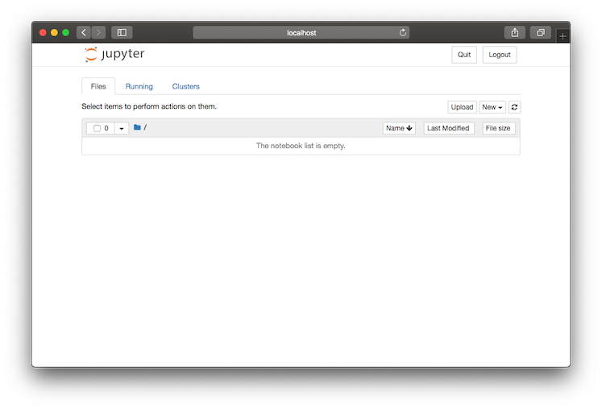
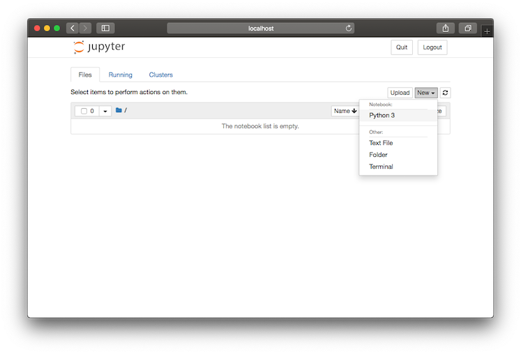
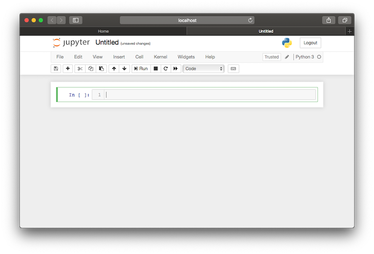
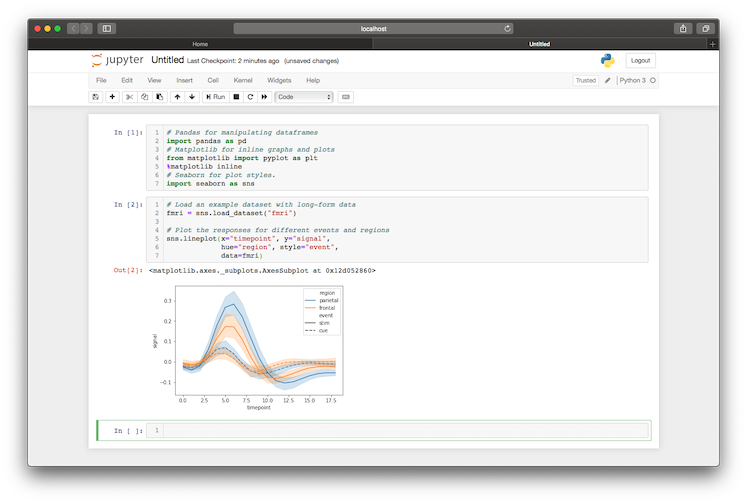
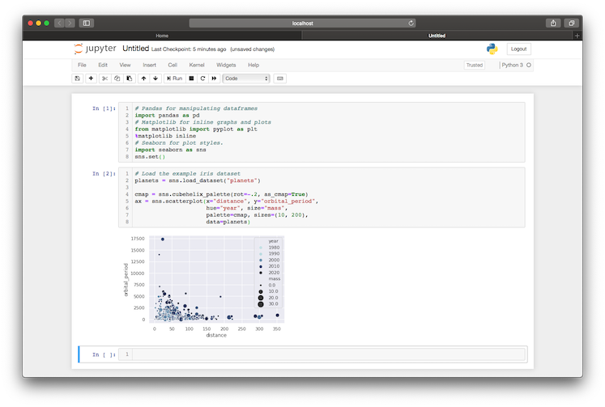

Jupyter Notebook is an interactive web application that interfaces with the iPython repl, allowing you to run structured but iterative Python scripts. It is the de facto choice for data scientists to rapidly prototype pipelines, visualise data, or perform ad hoc analysis.

Jupyter notebooks are a fantastic way to visual any data sets you might have, as well and conduct ad hoc analysis. **It is especially useful for querying databases and displaying the data in a repeatable manner.**

## Setting Up Your Environment
When working on any python project, I like to use Pyenv and the Pyenv Virtual Environment wrapper to manage all of the different python versions and dependencies. You can find the installation guides for on the [Pyenv GitHub repo](https://github.com/pyenv/pyenv#installation) and the [Virtual Env wrapper](https://github.com/pyenv/pyenv-virtualenv#installation).

If you don't have Python 3.6 installed already run the following:

```bash
$ pyenv install 3.6.0
```

Setup a new virtual environment and activate it:

```bash
# Create a Python 3.6.0 environment called jupyter-notebooks
$ pyenv virtualenv 3.6.0 jupyter-notebooks

# Start the virtual environment
$ pyenv activate jupyter-notebooks 
```

Next, install all of the dependencies you'll require:

```bash
$ pip install jupyter pandas numpy matplotlib seaborn
```

Finally, start your jupyter server in the directory you would like to save your notebooks:

```bash
$ jupyter notebook
```


<figcaption style={{textAlign:'center'}}>A New Jupyter Window</figcaption>

## Creating a notebook
Notebooks are created using the dropdown in the top right hand corner of the page. Jupyter will automatically open and start the notebook so you'll be ready to go.

<figcaption style={{textAlign:'center'}}>The Jupyter New Notebook Dropdown Menu</figcaption>


<figcaption style={{textAlign:'center'}}>An Empty Jupyter Notebook</figcaption>

Like with any other Python file, it is best practise to include your imports at the top of the file. In Jupyter, we can use the first cell for these. Shift + Enter runs the cell once you've written your script.

```py
# Pandas for manipulating dataframes
import pandas as pd

# Matplotlib for inline graphs and plots
from matplotlib import pyplot as plt
%matplotlib inline

# Seaborn for plot styles.
import seaborn as sns
```

## Reading in data
### CSV
Pandas has a handy function for reading in csv files. Below are a couple of examples, but Chris Albon has a [great blog post](https://chrisalbon.com/python/data_wrangling/pandas_dataframe_importing_csv/) about importing csv files if you need more information.

```py
# if the file has headers
df = pd.read_csv('path_to_file')

# if the file has no headers
df = pd.read_csv('path_to_file', headers=None)
```


## Exploring data
There are a number of methods to explore a data-frame once it has been loaded. To inspect the first _n_ rows, use the `head` function which returns the first 5 rows by default but can return any given number.

```py
# Print the first 5
df.head()

# Print the first 10
df.head(10)
```

To find out some basic information about the data held within the data-frame, the `describe` function outputs a summary of the values excluding any `NaN` values.

```py
df.describe()
```

Finally, to view a data-frame in its entirety pandas provides an `option_context` function to temporarily set options within a `with` context.

```py
# Set the max rows to print to 999 and print.
with pd.option_context('display.max_rows', 999):
    print (df)
```

## Modifying and filtering data
To access individual columns and values in a data-frame, pandas provides the `loc` parameter.

```py
# fetch a column
df['column_name']

# fetch a row
df.loc['index_value']

# fetch a single value
df.loc['index_value', 'column_name']

# filter a data-frame by a given condition
df.loc[lambda df: df['column_name'] > 3]
```

Columns can be added or modified easily using the `apply` function

```py
# create a new column based on other column values
df['new_column'] = df['old_column'].apply(lambda val: val * 2)

# override a column
df['old_column'] = df['old_column'].apply(lambda val: val * 2)
```

## Basic graphs
Graphing in Jupyter notebooks is as easy as calling a single seaboard function.
```py
# create a line plot using your data frame
sns.lineplot(x="my_x_field", y="my_y_field", data=my_data_frame)
```

<figcaption style={{textAlign:'center'}}>An Example Line Plot</figcaption>


```py
# create a scatter plot
sns.scatterplot(x="my_x_field", y="my_y_field", size="attribute_z",
                sizes=(10, 200), # size boundaries
                data=my_data_frame)
``` 

<figcaption style={{textAlign:'center'}}>An Example Scatter Plot</figcaption>

The [Seaborn website](https://seaborn.pydata.org/examples/index.html) provides a comprehensive list of examples, each with the code snippet used to generate them and some example data sets to explore.

## Bonus
Recently, GitHub has started rendering Jupyter notebooks in their UI, making it easier than ever to run and share notebooks. The iPython repository has a [good example](https://github.com/ipython/ipython/blob/6.x/examples/IPython%20Kernel/Index.ipynb).

### Useful links
[Pandas](https://pandas.pydata.org/)
[Seaborn](https://seaborn.pydata.org)
[Jupyter](https://jupyter.org/)